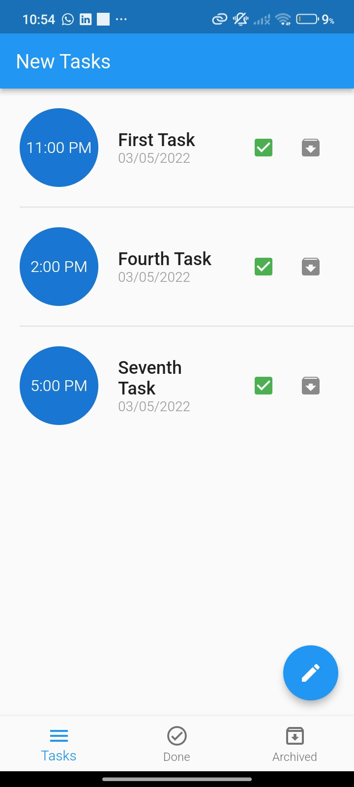
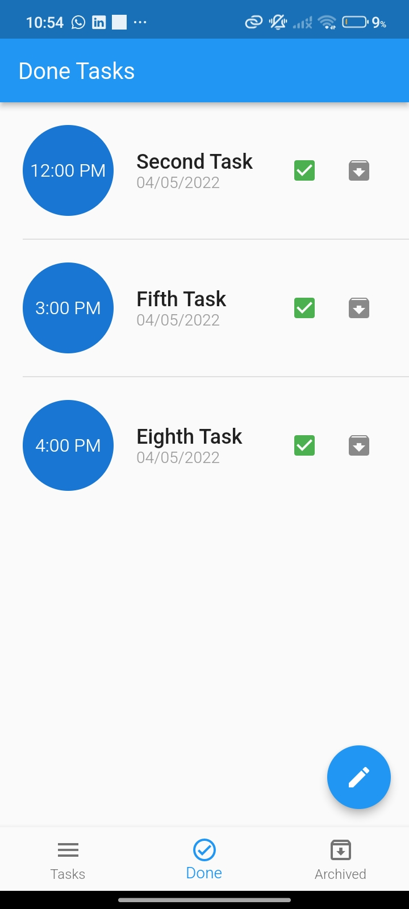
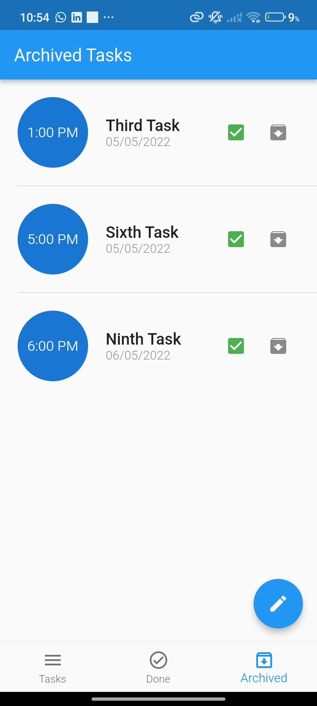
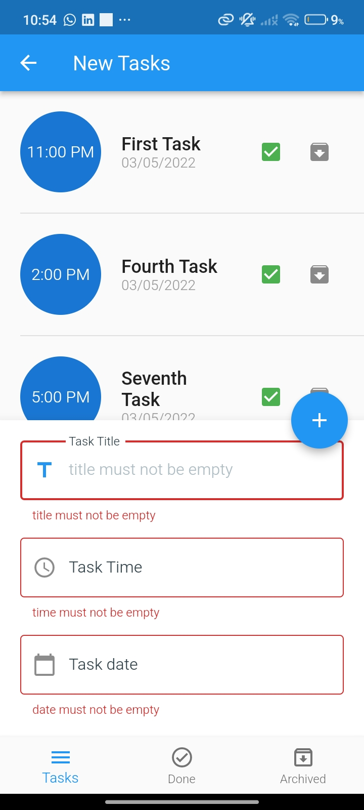

# Todo App

### This Flutter ToDo application uses BLoC " Cubit " for structured state management ,
and SQFlite as a local database to store tasks.
It allows users to create, done, and archive tasks.
while keeping all data saved locally on the device.

#### 🖼️ Screenshots

  
  
  
  

